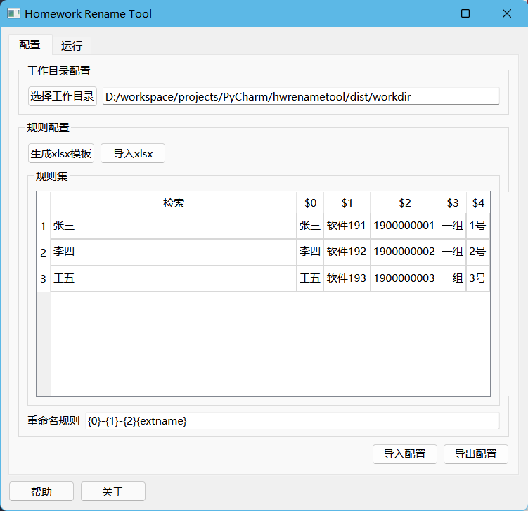
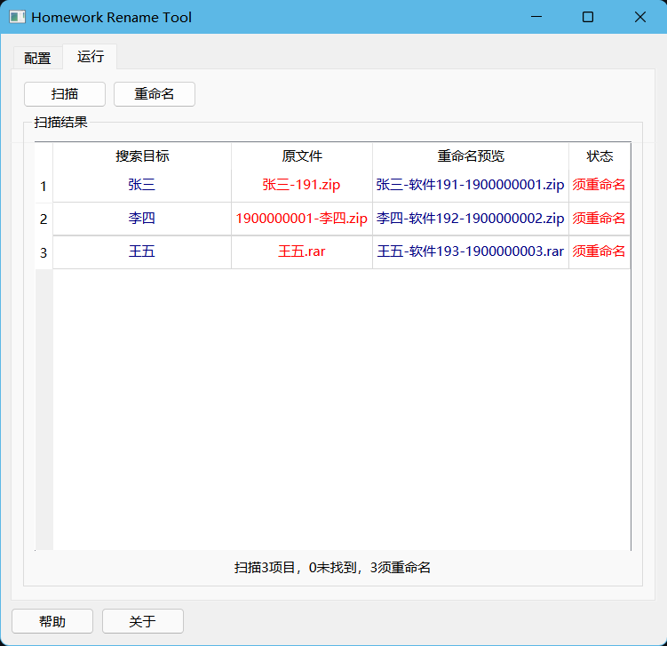

# Homework Rename Tool
此软件意于解放班长/学习委员/教学秘书于沉重繁复且无意义的重命名作业的痛苦中。
同时减少同学们被迫将作业重命名为「班级-学号-姓名」的时间。


具体来说，如果存在一个同学：
```json
{
  "name": "张三",
  "number": "123456789",
  "class": "软件工程191"
}
```
该软件可以批量将存在某字段的文件，如「张三.zip」，或「张三-123456789.zip」或「123456789-张三.zip」，重命名为「软件工程191-123456789-张三.zip」

当然，搜索的字段和重命名的字段可以自定义。




## 使用方法

### 第一次使用

1. 选择软件的工作目录，即需要批量重命名的作业目录
2. 生成用于导入的excel表单
  
    大概长这样：
    

    `检索`字段是用于搜索的字段
    之后的 `$0` - `$4` 字段是用于重命名的字段

3. 将班级的学生名单导入excel表单，$0-$4列是学号、姓名、班级等等数据（可以自定义）

4. 使用导入 xlsx 文件的功能，将excel表单导入到软件中
5. 检查（或重写）重命名规则

   规则中 `{0} - {4}` 分别代表对应Excel表单中的 `$0 - $4` 重命名字段
`{extname}` 代表文件的扩展名。其先后顺序和是否出现可以自定义
   
   对于默认的规则 `{0}-{1}-{2}{extname}` 与默认的表单
若存在文件`张三.zip`，则重命名为`张三-软件191-1900000001.zip`
6. 切换至 `运行` 选项卡，点击 `扫描`，软件将列出所有需要重命名的文件（以及重命名预览）
7. 点击 `重命名`，软件重命名符合条件的文件

### 重复使用
1. 可以使用 `导出配置` 功能，将软件的配置导出到文件中
2. 之后可以使用 `导入配置` 功能，将配置导入到软件中

   （注：导出与导入包含所有配置，包括规则、字段、班级名单等）

## 依赖

- pyqt6
- openpyxl
- pywin32

参阅 [requirements.txt](/requirements.txt)


# 开源协议

[GPL v3](https://www.gnu.org/licenses/gpl-3.0.html)


## 一些碎碎念

1. 收集作业推荐使用坚果云的文件收件箱 [坚果云收件箱](https://workspace.jianguoyun.com/inbox/)
上传者无需下载客户端和登录，直接在网页上提交，非常方便。
2. 以姓名作为搜索的主要依据的原因是，大部分人在打自己的名字的时候都不会打错。。。当然，
对于班级有重名的情况不是太友好。